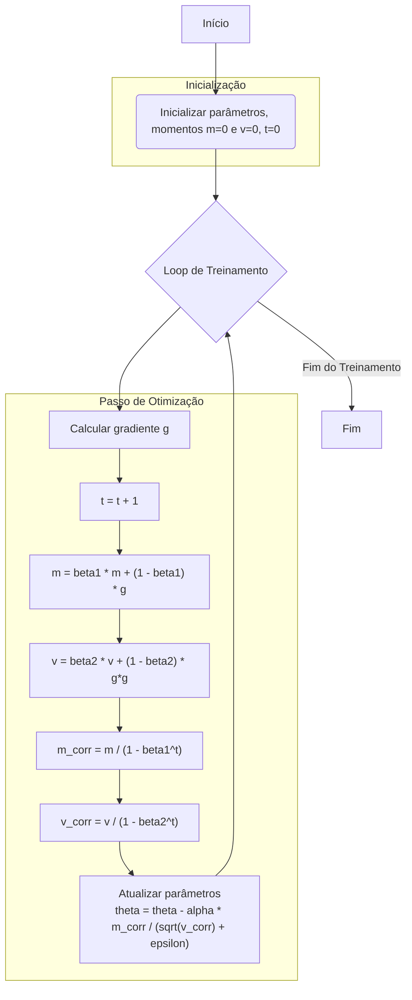

# Arquitetura do Projeto PINN para Análise de Tensão

Este documento descreve a arquitetura do projeto de Redes Neurais Informadas pela Física (PINN) para resolver a equação da função de tensão de Airy.

## Visão Geral

O projeto é estruturado para resolver uma equação diferencial ordinária (EDO) de 4ª ordem que modela as tensões em um anel sob pressão. A solução é encontrada treinando uma rede neural para satisfazer tanto a EDO quanto as condições de contorno especificadas.

## Estrutura de Diretórios

```
.
├── src
│   ├── app
│   │   ├── main.py         # Ponto de entrada e orquestrador principal
│   │   └── config.yaml     # Arquivo de configuração para o experimento
│   ├── configs
│   │   ├── bc.py           # Define as classes para condições de contorno
│   │   └── train_configs.py # Define a configuração do treinamento
│   ├── core
│   │   ├── equations.py    # Define a física do problema (EDO de Airy)
│   │   ├── solvers.py      # Implementa o solver PINN
│   │   ├── models.py       # Define a arquitetura da rede neural (MLP)
│   │   └── graphs.py       # Funções para gerar gráficos de resultados
│   └── tests
│       └── test_equations.py # Testes para as equações
└── docs
    └── ...                 # Gráficos e logs de treinamento gerados
```

## Fluxo de Execução

O fluxo de trabalho da aplicação pode ser visualizado no diagrama abaixo. Ele começa com a leitura da configuração, passa pelo treinamento do modelo e termina com a geração de resultados.

```mermaid
graph TD
    A[Início: main.py] --> B{Carregar config.yaml};
    B --> C{Setup do Experimento};
    C --> D[Instanciar Equação <br> (AiryStressEquation)];
    C --> E[Instanciar Modelo <br> (MLP1D)];
    C --> F[Instanciar Solver <br> (PINNSolver)];
    F --> G{Treinar Modelo};
    G --> H{Calcular Perda <br> (PDE + BC)};
    H --> I{Otimizar Pesos};
    G -- Loop de Treinamento --> H;
    G --> J{Avaliar Modelo};
    J --> K[Fazer Previsões <br> (phi, Trr, Ttt)];
    K --> L[Gerar Gráficos <br> (graphs.py)];
    L --> M[Fim];

    subgraph "Componentes Principais"
        D
        E
    end

    subgraph "Lógica do Solver"
        F
        G
        H
        I
    end
```

## Detalhamento dos Módulos

### 1. `src/app/main.py`
- **Responsabilidade**: Orquestrar todo o fluxo da aplicação.
- **Funcionamento**:
    1.  Carrega os parâmetros do `config.yaml`.
    2.  Usa `EquationFactory` para criar o objeto da equação (`AiryStressEquation`).
    3.  Inicializa o `PINNSolver` com a equação, o modelo e as configurações de treinamento.
    4.  Chama o método `train()` do solver para iniciar o treinamento.
    5.  Chama `evaluate_and_plot()` para gerar e salvar os gráficos de resultado.

### 2. `src/core/equations.py`
- **Responsabilidade**: Definir a física do problema.
- **Funcionamento**:
    - A classe `AiryStressEquation` implementa a EDO de 4ª ordem.
    - O método `residual()` calcula o quanto a saída da rede neural desvia da EDO. O objetivo do treinamento é minimizar esse resíduo.
    - Os métodos `trr()` e `ttt()` calculam as tensões radial e tangencial a partir da solução da rede (`phi`).
    - Fornece uma solução analítica (`T_rr_analytical`) para validação.

### 3. `src/core/solvers.py`
- **Responsabilidade**: Implementar o algoritmo da PINN.
- **Funcionamento**:
    - A classe `PINNSolver` gerencia o modelo de rede neural (`MLP1D`).
    - O método `_loss_batch()` calcula a função de perda, que é uma soma ponderada de duas componentes:
        - **Perda da PDE (`loss_pde`)**: O resíduo da equação diferencial.
        - **Perda das Condições de Contorno (`loss_bc`)**: O erro nas fronteiras do domínio.
    - O método `train()` executa o loop de otimização, ajustando os pesos do modelo para minimizar a perda total.

### 4. `src/core/models.py`
- **Responsabilidade**: Definir a arquitetura da rede neural.
- **Funcionamento**:
    - `MLP1D` é um Perceptron de Múltiplas Camadas simples que mapeia a coordenada radial `r` para a função de tensão `phi`. É o "solver universal" que aprende a solução da EDO.

### 5. `src/core/graphs.py`
- **Responsabilidade**: Visualização dos resultados.
- **Funcionamento**: Contém funções que usam `matplotlib` para gerar e salvar os gráficos comparando a solução da PINN com a solução analítica e dados de outras fontes (CATIA).

# Diagrama do Otimizador ADAM

Este diagrama ilustra o funcionamento do otimizador ADAM (Adaptive Moment Estimation), que é amplamente utilizado no treinamento de redes neurais.


